# Roguelike 升级系统

PinBall2D 的局内 Roguelike 增强机制：仅以「累计击杀里程碑」作为唯一触发，
按里程碑配表的品质权重抽出一个 `UpgradeRarity`，再在该品质池中无放回抽 3 张，
弹出三选一面板让玩家挑选。所有词条都作用于弹珠（Ball 机制参数化强化 + 新球种解锁/扩槽）。

## 1. 模块文件与职责

### 运行时

| 路径 | 职责 |
|------|------|
| `Assets/1_Scripts/Upgrade/BallStatType.cs` | 弹珠机制参数枚举（伤害、方向倍率、速度、反弹、穿透等） |
| `Assets/1_Scripts/Upgrade/BallStats.cs` | 全局弹珠属性容器（base + flat + percent，Get 时钳制） |
| `Assets/1_Scripts/Upgrade/BallType.cs` | 弹珠类型枚举（Base/Fire/Ice/Lightning/Poison/Heavy/Boomerang） |
| `Assets/1_Scripts/Upgrade/SpecialBallParams.cs` | 各 BallType 的全局参数字典（火球爆炸半径、冰球减速等） |
| `Assets/1_Scripts/Upgrade/UpgradeRarity.cs` | 品质枚举：Common/Uncommon/Rare/Legendary |
| `Assets/1_Scripts/Upgrade/UpgradeBase.cs` | 升级 SO 抽象基类 + `UpgradeContext` 应用上下文 |
| `Assets/1_Scripts/Upgrade/UpgradeService.cs` | 监听 `OnUnitKilled` → 阈值检测 → 抽池 → 暂停 → Apply → 恢复 |

### 数据 SO

| 路径 | 职责 |
|------|------|
| `Assets/1_Scripts/DataSO/KillMilestoneData.cs` | 单条里程碑（阈值 + 4 个品质权重） |
| `Assets/1_Scripts/DataSO/KillMilestoneTable.cs` | 里程碑列表 SO（表末按差值线性外推） |
| `Assets/1_Scripts/DataSO/UpgradeCatalog.cs` | 全局升级池：所有可抽到的 `UpgradeBase` 列表 |
| `Assets/1_Scripts/DataSO/BallStatUpgradeData.cs` | 数值类升级 SO（一条最多 3 个 modifier） |
| `Assets/1_Scripts/DataSO/NewBallUpgradeData.cs` | 新球类升级 SO（解锁/扩槽 + paramKeys/Values） |

### 派生弹珠

| 路径 | 职责 |
|------|------|
| `Assets/1_Scripts/PInBall/FirePinBall.cs` | 命中点 AOE 爆炸 |
| `Assets/1_Scripts/PInBall/IcePinBall.cs` | 命中后给附近 Unit 添加 `slowFactor` buff |
| `Assets/1_Scripts/PInBall/LightningPinBall.cs` | 命中后链式跳跃，每跳衰减伤害 |
| `Assets/1_Scripts/PInBall/PoisonPinBall.cs` | 命中后 DoT（每秒扣血） |
| `Assets/1_Scripts/PInBall/HeavyPinBall.cs` | 命中击退 + 额外伤害 |
| `Assets/1_Scripts/PInBall/BoomerangPinBall.cs` | 第一次触底自动回弹一次 |

### UI

| 路径 | 职责 |
|------|------|
| `Assets/1_Scripts/UI/UpgradeSelectionUI.cs` | 三选一面板：监听 `OnUpgradeOffered/OnUpgradeApplied` 显隐 |
| `Assets/1_Scripts/UI/InGameUI.cs` | HUD 多 BallType 库存显示 + 击杀计数与下次里程碑 |

### 配表

| 路径 | 职责 |
|------|------|
| `Assets/9_Excel/KillMilestones.csv` | 击杀里程碑表（阈值 + 各品质权重） |
| `Assets/9_Excel/Upgrades_Stat.csv` | 数值升级配表（id, name, desc, rarity, maxStack, mod1~3） |
| `Assets/9_Excel/Upgrades_NewBall.csv` | 新球升级配表（id, name, desc, rarity, maxStack, ballType, paramKeys, levelValues）— 每种特殊球一行 × 多级 |
| `Assets/8_Data/KillMilestoneTable.asset` | 由 DataImporter 生成 |
| `Assets/8_Data/UpgradeCatalog.asset` | 由 DataImporter 生成（同时引用所有 `Assets/8_Data/Upgrades/*.asset`） |
| `Assets/1_Scripts/Editor/DataImporter.cs` | 菜单 `Tools/Data/Import All` 一键导入全部 |

## 2. 触发与流程

```mermaid
flowchart LR
    Hit[PinBallBase.Tick 命中 Unit] --> Dir[计算命中方向 vs Unit.MoveDirection]
    Dir --> Dmg[BaseDamage * dirHitMul]
    Dmg --> Take[unit.TakeDamage]
    Take -->|destroyed| Kill[GameEvents.RaiseUnitKilled]
    Kill --> Svc[UpgradeService.OnKill +1]
    Svc -->|killCount==threshold| Roll[按权重抽品质 + 抽 3 张同品质]
    Roll --> Pause[GameState=SelectingUpgrade]
    Pause --> UI[UpgradeSelectionUI]
    UI -->|玩家点选| Apply[BallStats / Player.AddBalls / SpecialBallParams]
    Apply --> Resume[GameState=Running]
```



关键点：

- `PinBallBase.Tick` 内 `unit.TakeDamage` 后，无论是否击杀都会调用子类钩子 `OnHitUnit`，
  让 FirePinBall 等可在击杀前做 AOE。`destroyed=true` 时**先 Raise OnUnitKilled 再 RecycleUnit**，
  确保 UpgradeService / 子类拿到的 Unit 引用仍然有效。
- `UpgradeService.RollAndOffer` 调用 `GameLogicManager.PauseForUpgradeSelection()` 把状态切到
  `SelectingUpgrade`；该状态等同 `Paused`，`Update` 提前 return 不推进 difficulty 与 step。
- `ApplySelected` 调用 `GameLogicManager.ResumeFromUpgradeSelection()` 切回 `Running`。

## 3. 数据模型

### 3.1 BallStats（取代原 PlayerStats 设计）

```csharp
public enum BallStatType {
    BaseDamage,
    FrontHitMul, SideHitMul, BackHitMul,
    InitialSpeed, MinSpeed, MaxSpeed,
    BounceAccel, BounceSpeedMul, HitSlowdown,
    PiercingChance, PiercingKeepSpeed,
    MaxBounces, FireInterval
}
```

- 读取：`BallStats.Get(t) = base * (1 + sumPct) + sumFlat`，再按类型统一钳制（见 `BallStats.Clamp`）。
- 写入：`AddFlat(t, v)` / `AddPercent(t, v)`；`Reset()` 在 `GameLogicManager.StartGame` 时清空到默认基础值。
- 命中方向：以 Unit.MoveDirection 为基准。Unit 默认向下移动，则球撞顶边（normal=Vector2.up）= 正面对撞 `FrontHit`，撞底边 = 背面追击 `BackHit`，撞左右 = `SideHit`。

### 3.2 数值词条 CSV（多 modifier）

`Upgrades_Stat.csv` 列：

```
id, name, desc, rarity, maxStack,
mod1Stat, mod1Flat, mod1Pct,
mod2Stat, mod2Flat, mod2Pct,
mod3Stat, mod3Flat, mod3Pct
```

样例：

```
ball_speed_burst, 高初速冷却, 初始速度+30% 但命中后减速30%, Uncommon, 3, InitialSpeed, 0, 0.3, HitSlowdown, 0, 0.3, , 0, 0
```

`mod1Stat` 留空表示「不使用此修饰器」，导入时跳过。同 id 的词条堆叠时再次 Apply（再叠加一次），
直到 `currentStack >= maxStack` 后从抽卡池剔除。

### 3.3 新球词条 CSV（单实例 + 多级）

每种特殊球**全程至多 1 颗**（队列内 + 飞行中合计），因此 `Upgrades_NewBall.csv` 给每种特殊球**仅一行**，靠抽到的次数升级。`Upgrades_NewBall.csv` 列：

```
id, name, desc, rarity, maxStack, ballType, paramKeys, levelValues
```

- `maxStack` 同时也是该球的**满级**：例如 `5` 表示 Lv1~Lv5。
- `paramKeys`：`|` 分隔的参数键名，与各级 values 一一对应。
- `levelValues`：`;` 分隔多个等级，每个等级用 `|` 分隔的若干 float（与 paramKeys 等长）。**绝对值**——升级时 `SpecialBallParams.Set(type, key, lvN_value)` 直接覆盖上一级。
- 首次抽到（`currentStack==0`）= 解锁 + 写入 Lv1 参数 + `Player.AddBalls(ballType, 1)` 入队 1 颗；之后每次再抽到 = 仅升级 + 写入新等级参数，**不再入队**。`currentStack` 升满 `maxStack` 后从抽卡池剔除。
- `ballType=Base` 是退化形态：每次 Apply 都 `Player.AddBalls(Base, 1)` 入队尾，可堆叠到 `maxStack` 次；`paramKeys`/`levelValues` 留空。

样例：

```
new_fire,    引燃,   火球：命中点AOE爆炸（满级 Lv5）, Rare, 5, Fire,  explosionRadius|explosionDamage, 1.0|1;1.5|1;2.0|2;2.5|2;3.0|3
new_lightning,链电,雷球：命中后链跳目标（满级 Lv5）, Rare, 5, Lightning, chainCount|chainDecay|chainRange, 3|0.3|2.5;4|0.28|3.0;5|0.25|3.5;6|0.22|4.0;7|0.2|4.5
new_base_more, 弹匣扩容, 普通球+1 入队尾, Common, 5, Base,  ,
```

> 历史 `slotsAdd` 与 `allSpecialSlotsAdd` / `xxxAdd` 累加 key 已废弃。如需再做 Legendary 类「全员升级」效果，可在代码里另行实现（遍历 `Player.UnlockedSpecials` 找对应 SO 调 Apply）。

### 3.4 里程碑表 CSV

`KillMilestones.csv`：

```
killThreshold, weightCommon, weightUncommon, weightRare, weightLegendary
5,    70, 25, 5,  0
15,   60, 30, 10, 0
30,   50, 30, 18, 2
50,   40, 32, 23, 5
75,   30, 32, 28, 10
105,  20, 30, 32, 18
140,  15, 25, 35, 25
180,  10, 20, 35, 35
```

`UpgradeService` 用 `nextMilestoneIdx` 在表中前进；表末之后按 `last - second_last` 差值线性外推
（保留最后一行权重），让游戏后期仍有持续升级机会。

## 4. 弹珠与发射

### 4.1 库存模型(全局 FIFO 队列)

`Player` 弃用 `maxPinBallCount/fireInterval/firePinBallSpeed` 三个独立字段;弹珠库存重构为**单一 `Queue<BallType> ballQueue`**——发射 = 队首出队,球碰底回收 = 队尾入队,谁先回来谁先飞。

- **初始化**：`Init()` 时把 `Player.initialBallCount`(Inspector 字段，默认 5)个 `BallType.Base` 入队，`totalBalls = 初始值`。
- **容量**：`TotalBalls = ballQueue.Count + BallsInFlight`。`AddBalls` 增加 totalBalls，`AddPinBall` 不增加。
- **特殊球解锁**：默认 0；任何 `AddBalls(BallType.NotBase, N)` 调用都会同时把该类型加入 `unlockedSpecials` 集合，并在队尾追加 N 颗。
- **发射**：F 键 → `ballQueue.Dequeue()` → `SpawnPinBall(BallAddress[type], ...)`；初速从 `BallStats.InitialSpeed`、冷却从 `BallStats.FireInterval` 读取。**没有优先级——队首是什么发什么**。
- **回收**：`PoolManager.RecyclePinBall` 调到 `GameLogicManager.RecyclePinBall`，根据 `pb.BallType` 调 `player.AddPinBall(type)` 入队尾，**不改变 totalBalls**。
- **HUD**：`InGameUI` 直接遍历 `Player.BallQueue` 按队首→队尾渲染单字符 + TMP 颜色 tag，末尾追加 `(BallsInFlight/TotalBalls)` 汇总。

### 4.2 派生球扩展点

`PinBallBase.OnHitUnit(unit, hitPos, hitNormal, dir, destroyed)` 是子类钩子。基类负责伤害结算 + 反弹/穿透；
子类只需在此叠加额外效果。例如：

- `FirePinBall`：以命中点为中心，对所有距离 ≤ `explosionRadius` 的 Unit 各 `TakeDamage(explosionDamage)`。
- `IcePinBall`：调 `unit.ApplySlow(1 - slowPct, slowDuration)`；`UnitBase` 用浮点累计实现「平均每 1/factor 次 Step 才执行一次实际下移」。
- `LightningPinBall`：从命中点出发链式找最近 N 个 Unit，每跳 `currentDmg *= (1 - chainDecay)`。

新球种 prefab 制作：复制 `BaseBall.prefab` → 把脚本替换为对应派生类 → 在 `BallType` 字段填正确的枚举值 → 加入 Addressables 并使用与 `Player.BallAddress` 一致的地址（`FireBall`/`IceBall`/...）。

## 5. 接入步骤（首次构建）

1. **导入配表**：菜单 `Tools/Data/Import All` 会导入 `Difficulty / KillMilestones / Upgrades_Stat / Upgrades_NewBall`，并自动写入：
   - `Assets/8_Data/KillMilestoneTable.asset`
   - `Assets/8_Data/UpgradeCatalog.asset`
   - `Assets/8_Data/Upgrades/Stat_*.asset`
   - `Assets/8_Data/Upgrades/NewBall_*.asset`
2. **Addressables**：手动把以下资源加入对应 Addressables Group（地址使用文件名）：
   - `KillMilestoneTable.asset` → 地址 `KillMilestoneTable`，加入 `Data` 组
   - `UpgradeCatalog.asset`     → 地址 `UpgradeCatalog`，加入 `Data` 组
   - 各特殊球 prefab（`FireBall.prefab` / `IceBall.prefab` / `LightningBall.prefab` / ...） → 加入 `Unit` 组（与 `BaseBall` 同组）
3. **场景**：在 Canvas 下复制 `GameHUD.prefab`/`GameOverScreen.prefab` 同级新建 `UpgradeSelectionUI` 面板，挂上脚本并把根节点拖到 `UIManager.upgradeSelectionUI`。三张卡片（按钮 + name/desc/rarity 文本 + 背景 Image）配置到脚本的 `cards` 列表里。
4. **运行**：开局后击杀 5 个 Unit 触发首个升级；所有词条均可堆叠到 `maxStack` 后从抽卡池剔除；过 8 个里程碑后按差值线性外推。

## 6. 与既有系统的关系

- `Difficulty`：保持原状不变。升级系统只动 Player/Ball 侧，不改 `Unit.Attack`（保持 `unitAttack=1` 设计目标）。
- `GameEvents`：新增 `OnUnitKilled / OnKillMilestoneReached / OnUpgradeOffered / OnUpgradeApplied`。
- `GameState`：新增 `SelectingUpgrade`，`Update` 提前 return（同 `Paused` / `Ended` / `Preparing`）。
- `PoolManager`：保持按 address 路由 prefab；`PinBallBase.BallType` 字段在 prefab 上固定，回收时用于决定归还库存。

## 7. 扩展指引

- **新增数值参数**：在 `BallStatType` 加枚举 → `BallStats.Reset()` 设默认 → `BallStats.Clamp()` 加钳制 → 在 `PinBallBase` 的命中/反弹分支里 `stats.Get(...)` 使用。
- **新增特殊球**：派生 `PinBallBase` → override `OnHitUnit`（或 `Tick` 用于改边框检测） → 制作 prefab 加入 Addressables → 在 `Player.BallAddress` 字典加上 `BallType → 地址` 映射 → CSV 增加 `new_xxx_basic` 行（`ballType=该枚举`，`slotsAdd≥1`） → 重新 Import。同时建议在 `InGameUI.QueueLabels`/`QueueColors` 加上 HUD 显示的字母与颜色。
- **新增稀有度**：在 `UpgradeRarity` 加枚举 → `UpgradeService.PickThree` 的 `BuildFallbackOrder` 自动覆盖 → CSV 里程碑表增加一列权重 → `KillMilestoneData` / `DataImporter.ImportKillMilestones` 同步。
