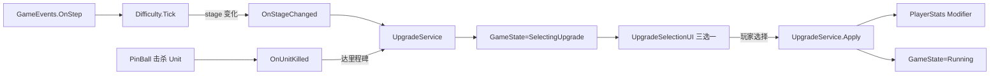
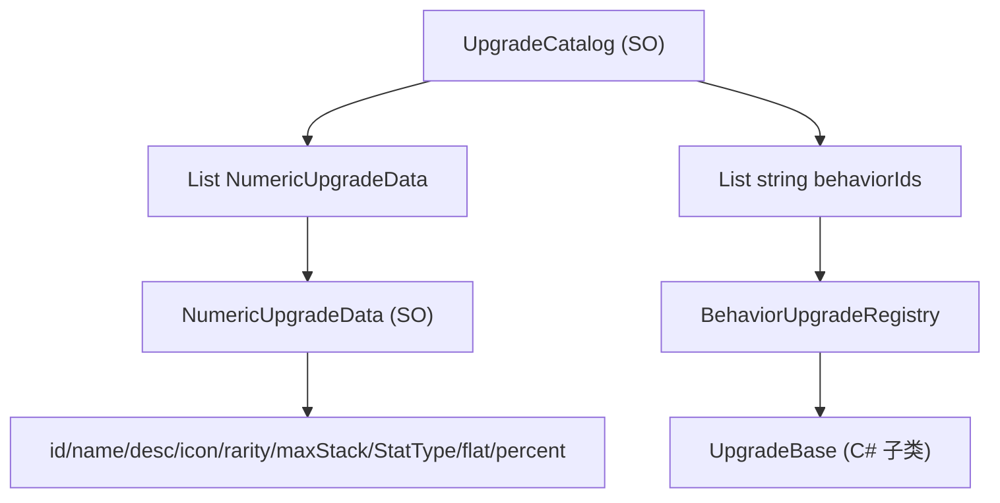

# PinBall2D Roguelike 增强系统设计

## 1. 核心循环

主触发：**进入新难度阶段** → 暂停游戏 → 弹三选一面板 → 选中后应用并恢复  
副触发：**累计击杀达到里程碑**（10 / 25 / 50 / 100 …）→ 同上

理由：阶段切换天然贴合现有 [Assets/1_Scripts/Mgr/Difficulty.cs](Assets/1_Scripts/Mgr/Difficulty.cs)，零改造即可获得"30s / 60s / 120s / 180s"4 次保底升级，恰好赶在 180s 断崖前形成 Build；击杀里程碑奖励操作精度，让强玩家更早起飞。




## 2. 稀有度（颗粒度由稀有度承载）

- 白（Common, 60%）：纯数值微调
- 蓝（Uncommon, 25%）：大数值 / 弱行为
- 紫（Rare, 12%）：行为词条
- 金（Legendary, 3%）：构筑核心

权重随 `Difficulty.GameTime` 线性偏移：120s 后蓝紫权重逐步提升、白色衰减；240s 后开始放金。

## 3. 数值修饰层（基础设施 - 必须先做）

新建 [Assets/1_Scripts/Upgrade/PlayerStats.cs](Assets/1_Scripts/Upgrade/PlayerStats.cs)，统一管理"基础值 + 修饰器"：

```csharp
public enum StatType {
    MaxHp, MaxPinBall, FireInterval, FirePinBallSpeed,
    PinBallMinSpeed, PinBallBounceMul, PinBallDamage,
    StepIntervalMul   // 全局减速 buff 用
}

public class PlayerStats {
    public float Get(StatType t);            // base * (1+sumPct) + sumFlat，按 stat 类型钳制
    public void AddFlat(StatType, float);
    public void AddPercent(StatType, float);
}
```

[Assets/1_Scripts/Player.cs](Assets/1_Scripts/Player.cs) 中 `maxPinBallCount`、`fireInterval`、`firePinBallSpeed`、`maxHp` 全部改为通过 `PlayerStats.Get()` 读取；Inspector 上的字段降级为"基础值"。[Assets/1_Scripts/PInBall/PinBallBase.cs](Assets/1_Scripts/PInBall/PinBallBase.cs) 的 `minSpeed`、`bounceSpeedMultiplier` 同理（在 `Init` 里从 `PlayerStats` 拉一次）。

## 4. 数据结构




- 数值类全数据驱动：`NumericUpgradeData : ScriptableObject`
- 行为类需 C# 代码实现：`UpgradeBase` 抽象基类 + 字符串 id 注册查找
- `UpgradeCatalog : ScriptableObject` 持有所有可抽池条目

## 5. 文件清单

### 新增

- [Assets/1_Scripts/Upgrade/PlayerStats.cs](Assets/1_Scripts/Upgrade/PlayerStats.cs)
- [Assets/1_Scripts/Upgrade/StatType.cs](Assets/1_Scripts/Upgrade/StatType.cs)
- [Assets/1_Scripts/Upgrade/UpgradeRarity.cs](Assets/1_Scripts/Upgrade/UpgradeRarity.cs)
- [Assets/1_Scripts/Upgrade/UpgradeBase.cs](Assets/1_Scripts/Upgrade/UpgradeBase.cs)
- [Assets/1_Scripts/Upgrade/UpgradeService.cs](Assets/1_Scripts/Upgrade/UpgradeService.cs)（触发、抽池、应用、暂停/恢复）
- [Assets/1_Scripts/Upgrade/Upgrades/Numeric/NumericUpgrade.cs](Assets/1_Scripts/Upgrade/Upgrades/Numeric/NumericUpgrade.cs)（通用数值实现）
- [Assets/1_Scripts/Upgrade/Upgrades/Behavior/MultiShotUpgrade.cs](Assets/1_Scripts/Upgrade/Upgrades/Behavior/MultiShotUpgrade.cs)（紫，多发）
- [Assets/1_Scripts/Upgrade/Upgrades/Behavior/PiercingUpgrade.cs](Assets/1_Scripts/Upgrade/Upgrades/Behavior/PiercingUpgrade.cs)（紫，穿透）
- [Assets/1_Scripts/Upgrade/Upgrades/Behavior/ExplosionUpgrade.cs](Assets/1_Scripts/Upgrade/Upgrades/Behavior/ExplosionUpgrade.cs)（紫，爆炸）
- [Assets/1_Scripts/DataSO/NumericUpgradeData.cs](Assets/1_Scripts/DataSO/NumericUpgradeData.cs)
- [Assets/1_Scripts/DataSO/UpgradeCatalog.cs](Assets/1_Scripts/DataSO/UpgradeCatalog.cs)
- [Assets/1_Scripts/UI/UpgradeSelectionUI.cs](Assets/1_Scripts/UI/UpgradeSelectionUI.cs)（三选一面板，Pause 半透明背景 + 3 张卡）
- [doc/Function/Upgrade.md](doc/Function/Upgrade.md)
- [Assets/8_Data/Upgrades/](Assets/8_Data/Upgrades/) 目录与各 SO 资源
- [Assets/9_Excel/Upgrades.csv](Assets/9_Excel/Upgrades.csv) + [Assets/1_Scripts/Editor/DataImporter.cs](Assets/1_Scripts/Editor/DataImporter.cs) 扩展（仅数值类）

### 修改

- [Assets/1_Scripts/Mgr/GameEnum.cs](Assets/1_Scripts/Mgr/GameEnum.cs)：新增 `GameState.SelectingUpgrade`
- [Assets/1_Scripts/Mgr/GameEvents.cs](Assets/1_Scripts/Mgr/GameEvents.cs)：新增 `OnStageChanged(int newIdx) / OnUnitKilled / OnUpgradeOffered / OnUpgradeApplied`
- [Assets/1_Scripts/Mgr/Difficulty.cs](Assets/1_Scripts/Mgr/Difficulty.cs)：`Tick` 中对比上帧/本帧的 stage 索引，变化则 raise `OnStageChanged`
- [Assets/1_Scripts/Player.cs](Assets/1_Scripts/Player.cs)：注入 `PlayerStats`，所有数值字段走 stats
- [Assets/1_Scripts/PInBall/PinBallBase.cs](Assets/1_Scripts/PInBall/PinBallBase.cs)：从 `PlayerStats` 读 `minSpeed/bounceMul`；击杀 Unit 时 raise `OnUnitKilled`；行为类 Upgrade（穿透 / 爆炸）通过 `UpgradeService` 查询当前生效项注入逻辑分支
- [Assets/1_Scripts/Mgr/GameLogicManager.cs](Assets/1_Scripts/Mgr/GameLogicManager.cs)：持有 `UpgradeService` 与 `PlayerStats`；`Update` 中 `SelectingUpgrade` 状态等同 `Paused` 不推进；`StartGame` 时重置 stats 与服务
- [Assets/1_Scripts/Mgr/UIManager.cs](Assets/1_Scripts/Mgr/UIManager.cs)：监听 `OnUpgradeOffered/OnUpgradeApplied` 显隐 `UpgradeSelectionUI`
- [doc/Design/Design.md](doc/Design/Design.md) / [doc/Design/PROJECT.md](doc/Design/PROJECT.md)：补充 Upgrade 模块索引

## 6. MVP 升级条目（Phase 1 实装）

数值（白，5 项）：

- `+1 MaxHp`（最多堆 5 层）
- `+1 MaxPinBall`（最多 5 层）
- `-10% FireInterval`（最多 6 层，下限 0.05s）
- `+10% FirePinBallSpeed`（最多 6 层）
- `+5% PinBallBounceMul`（最多 4 层，上限 1.0）

数值升级版（蓝，3 项）：

- `+2 MaxPinBall`、`-20% FireInterval`、`+1 PinBallDamage`

行为（紫，3 项）：

- `MultiShot`：每次发射多 1 颗（小角度散射），堆叠到 3
- `Piercing`：弹珠击杀 Unit 后保持 70% 速度继续穿透，不立即停止（当前击杀也不停，但会反弹；穿透 = 跳过反弹）
- `Explosion`：击杀 Unit 时对周围 1 格 AOE 1 伤害

金（金，1 项占位）：

- `Shotgun`：每次发射 3 颗扇形（与 MultiShot 互斥，作为 Phase 3 实装示意）

## 7. 关键约束

- `unitAttack` 全程固定为 1 的设计目标不变（[doc/Data/DifficultyBalance.md](doc/Data/DifficultyBalance.md) 第 15 行），所以 Upgrade 不能改 `Unit.Attack`，只改 Player 侧
- 所有 modifier 在 `OnGameStart` / `RestartGame` 时清空，`PlayerStats` 重置为基础值
- `SelectingUpgrade` 状态下 `Difficulty.Tick` 也不推进（避免在选卡时累计游戏时间），实现方式与 `Paused` 一致：在 `GameLogicManager.Update` 中提前 return
- 三选一面板抽卡时：剔除已堆满（达 maxStack）的条目；如果池为空（理论极端情况）保底给一个 +1 MaxHp

## 8. 分阶段实施

**Phase 1（核心闭环，本次落地）**：基础设施 + 阶段切换触发 + 5 数值升级 + 三选一 UI  
**Phase 2**：击杀里程碑触发 + 3 蓝 + 3 紫行为升级 + 数值升级 CSV 导入  
**Phase 3**：金色 + 协同 synergy + 局外 meta 永久升级